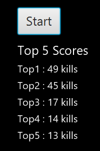

# Projet de Jeu en Java (Infinite Cube Frenzy)

Bienvenue dans le projet de jeu Java ! Ce jeu offre une expérience immersive où le joueur affronte différents types d'ennemis, collecte des bonus, et gère ses munitions pour survivre le plus longtemps possible. Le projet est développé en Java et utilise JavaFX pour la partie graphique.

## Table des matières

- [Aperçu du Jeu](#aperçu-du-jeu)
- [Fonctionnalités](#fonctionnalités)
- [Gameplay](#gameplay)
- [Installation](#installation)
- [Utilisation](#utilisation)
- [Captures d'écran](#captures-décran)
- [Structure du Code](#structure-du-code)
- [Contributeurs](#contributeurs)

## Aperçu du Jeu

Le joueur doit survivre en éliminant des ennemis et en les évitant. Il peut collecter des bonus comme des packs de munitions et des vies supplémentaires pour prolonger sa partie. L'objectif est d'atteindre le meilleur score possible.

## Fonctionnalités

- **Attaque Normale** : Le joueur peut tirer un projectile pour toucher l'ennemi.
    - 

- **Attaque Spéciale** : Une attaque plus puissante, utilise 5 projectiles.
    - 

- **Types d'ennemis** :
    - **Ennemi Standard** : Ennemi basique qui se dirige vers le joueur.
        - 
    - **Ennemi Orange** : Plus rapide et capable d'esquiver certains projectiles.
        - 

- **Objets** :
    - **Pack de munitions** : Reconstitue les munitions du joueur lorsque collecté.
        - 
    - **Vie Supplémentaire** : Augmente la vie du joueur pour prolonger sa survie.
        - 

- **Menu** : Interface de menu principal permettant de commencer une partie ou de quitter.
    - 

## Gameplay

Le joueur démarre avec un nombre limité de munitions et de santé. Son but est de survivre le plus longtemps possible en éliminant les ennemis tout en collectant des bonus de munitions et des vies supplémentaires.

1. **Déplacement** : Le joueur peut se déplacer en utilisant les touches directionnelles pour éviter les ennemis.
2. **Tir** : Le joueur peut tirer des projectiles pour éliminer les ennemis.
3. **Gestion des Munitions** : Les munitions sont limitées. Il est donc essentiel de récupérer les packs de munitions et de bien gérer ses attaques.
4. **Esquive des Ennemis** : Certains ennemis comme l'ennemi orange peuvent esquiver les projectiles, rendant le jeu plus stratégique.

## Installation

1. **Prérequis** :
    - [Java JDK 11+](https://www.oracle.com/java/technologies/javase-jdk11-downloads.html)
    - [JavaFX](https://openjfx.io/)

2. **Cloner le dépôt** :
   ```bash
   git clone https://github.com/Oriloo/Infinite-Cube-Frenzy.git
   ```

3. **Compiler et Exécuter** :
   Utilisez votre IDE Java préféré (comme IntelliJ IDEA ou Eclipse) ou compilez en ligne de commande :
   ```bash
   javac -d bin -sourcepath src src/main/java/com/testgame/testgame/GameApp.java
   java -cp bin com.testgame.testgame.GameApp
   ```

## Utilisation

- **Démarrage** : Lancez le jeu à partir du menu principal.
- **Commandes** :
    - **Déplacement** : Utilisez les flèches directionnelles.
    - **Attaque Normale** : Appuyez sur la barre d'espace pour tirer un projectile.
    - **Collecte de Bonus** : Passez sur un pack de munitions ou une vie supplémentaire pour le collecter.

## Captures d'écran

### Joueur


### Projectile


### Ennemi Standard


### Ennemi Orange


### Pack de Munitions


### Vie Supplémentaire


## Structure du Code

La structure principale du code est organisée comme suit :

- **`GameApp`** : Point d'entrée de l'application. Configure la scène et initialise les composants principaux.
- **`GameEventHandler`** : Gère les événements de jeu, tels que les interactions et les états.
- **`InputHandler`** : Gère les entrées clavier pour les déplacements et les tirs.
- **`Player`** : Classe représentant le joueur, avec la gestion des munitions, de la santé et des déplacements.
- **`Enemy` et `EnemyOrange`** : Représentent différents types d'ennemis avec des comportements spécifiques.
- **`Projectile`** : Classe pour les projectiles tirés par le joueur.
- **`AmmoPack` et `ExtraLifeItem`** : Classes pour les objets de bonus.

## Contributeurs

- **Pol-Mattis Harquet** : Développeur principal